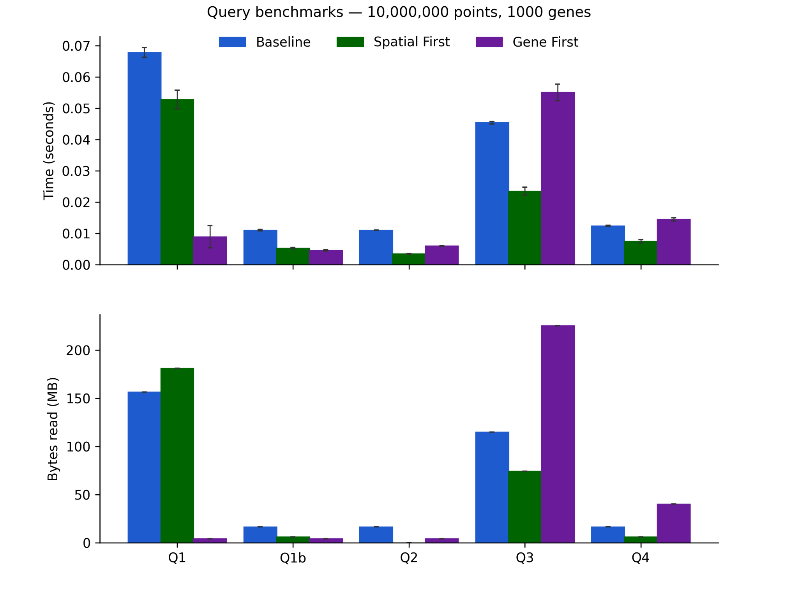
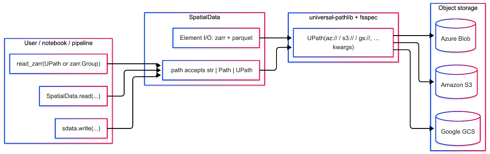
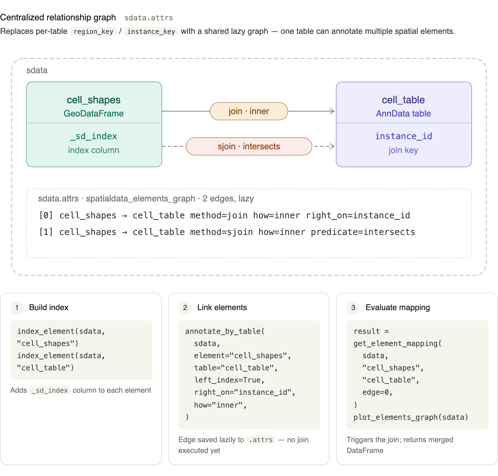
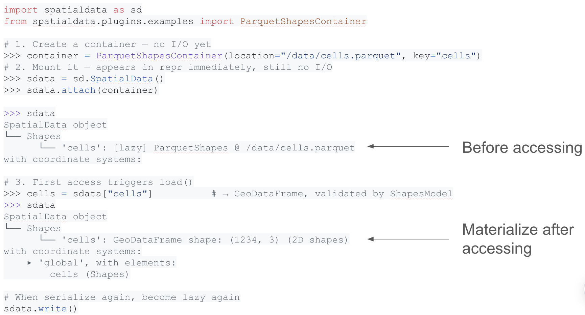
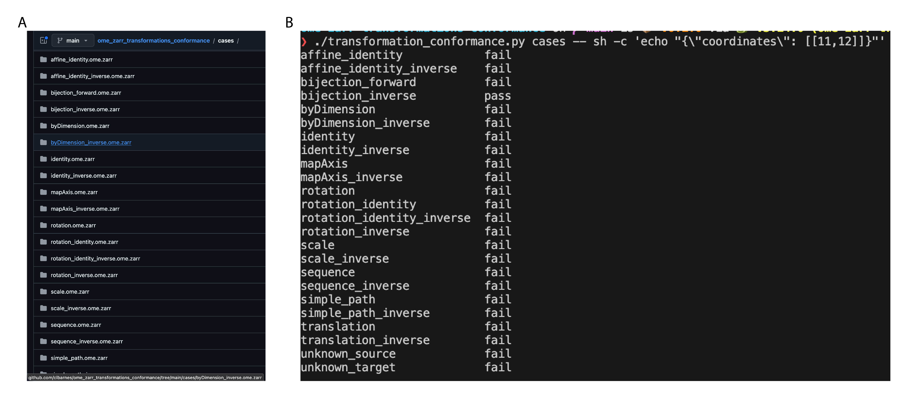

<!-- Note that you can use https://sparontologies.github.io/cito/current/cito.html#objectproperties
for more detailed citations for text mining e.g. [@uses_method_in:marconato_spatialdata_2024] -->

# Abstract

This preprint outlines the results of the "2nd SpatialData Hackathon" organised by the scverse and Bioconductor teams. The event gathered experts to advance spatial omics through four hackathon tracks: (i) R interoperability, (ii) accessibility and performance of visualization tools, (iii) design modernization for the SpatialData framework, and (iv) file formats and transformations (NGFF).
Key achievements include extending the SpatialData, Zarr and bioimaging frameworks to R/Bioconductor ecosystem, improving visualization with 2.5D/3D rendering and a chunked multiscale point representation, introducing cloud-based IO and prototypes for lazy file linking and bidirectional element-table relationships, and developing a language-agnostic conformance test suite for OME-NGFF coordinate transformations. The hackathon fostered collaboration, creating infrastructure prototypes and identifying interoperability challenges. Documented on GitHub, these efforts brought together 24 participants from the US and Europe, promoting a FAIR ecosystem of spatial omics and imaging tools.

# Introduction

The "2nd SpatialData Hackathon" was an in-person event organized by the scverse SpatialData and Bioconductor teams, and funded by the Helmholtz Association (ScienceServe Project Call) that brought together expertise from different fields, including methods developers of a variety of tools for bioimaging, single-cell and spatial omics. The purpose was to explore new directions to advance the field of spatial omics [@Marconato2024-ya]. By leveraging multiple programming languages, including Python, R, and JavaScript, the event focused on four central hackathon tracks:

* R interoperability
* Accessibility, maintainability and performance of visualization tools
* Design modernization for the SpatialData framework
* File formats and transformations (NGFF)

Key achievements include:

* *R interoperability*: The R *spatialdataR* package gained support for Zarr v2/v3 read/write, spatial, table-based queries and coordinate transformations. Several new and extended R packages improve OME-Zarr handling (*ImageArray* and *romeo* packages), cross-language AnnData [@Virshup2024-cn] compatibility via Zarr support for *anndataR* package, and conformance with Open Microscopy Environment Next-Generation File Format (OME-NGFF) specifications (*romeo* package).
* *Accessibility, maintainability and performance of visualization tools*: Visualization capabilities were extended across napari, Vitessce, Neuroglancer, and SpatialData.js, with new support for 2.5D/3D rendering and interactive annotation. A chunked, multiscale point representation was designed and benchmarked, substantially reducing data read for large-scale viewport queries. A new notebook-based interactive annotation workflow is presented.
* *Design modernization for the SpatialData framework*: Cloud-based input/output (IO) was introduced, enabling direct read/write against remote object stores via fsspec. Prototypes were developed for lazy external file linking, bidirectional element-table relationships, and contour-aware spatial density profiling.
* *File formats and transformations (NGFF)*: A language-agnostic conformance test suite for OME-NGFF Request for Comments 5 (RFC-5) coordinate transformations was developed, alongside extensions to the `transformnd` library covering most RFC-5 transformations across multiple array backends. A prototype integration with `multiview-stitcher` enables tile stitching and fusion directly within SpatialData workflows.

The hackathon fostered collaboration, creating infrastructure prototypes and identifying interoperability challenges. Documented on GitHub, these efforts brought together 24 participants from the United States and Europe, promoting a Findable, Accessible, Interoperable and Reusable (FAIR) ecosystem of spatial omics and imaging tools.

# Results

All the issues were tracked in a public project board accessible here: [https://github.com/orgs/scverse/projects/70/views/1](https://github.com/orgs/scverse/projects/70/views/1).

## R interoperability

This track introduced numerous utilities to the existing Bioconductor packages to interface with SpatialData objects on disk. These packages are mainly designed to serve as dependencies for the spatialdataR package, an R wrapper of the SpatialData framework [@Marconato2024-ya], that will be submitted to Bioconductor soon.

**spatialdataR** \[[HelenaLC/spatialdataR](https://github.com/HelenaLC/spatialdataR)\]: The R package now supports Zarr v3 handling and includes improved show-method of SpatialData Zarr attributes; added various methods to streamline internal operations (e.g., accessing links between layers); added general utilities (e.g., spatial extent, retrieving centroids of elements). A first draft of coordinate space transformations is now complete (with the exception of affine transformations), including scale, rotation, translation, sequence, etc. The package now also supports table-based queries (e.g., using observation metadata), spatial queries (polygonal, bounding box), aggregation of information between layers (e.g., masking points by shapes to obtain a table), etc. Finally, a draft pull request provides write utilities for spatial elements of images, labels, points and shapes in both Zarr v2 and v3, including roundtrip tests for conformance with [scverse/spatialdata](https://github.com/scverse/spatialdata) \[[\#163](https://github.com/HelenaLC/spatialdataR/pull/163)\].

**dummy-spatialdata** \[[BIMSBbioinfo/dummy-spatialdata](https://github.com/BIMSBbioinfo/dummy-spatialdata)\]: Python package (also available on PyPI) to generate artificial SpatialData Zarr stores for code development, unit testing, documentation, etc. The Python package is well-integrated with the SpatialData.data R package to generate example SpatialData Zarr datasets using reticulate and basilisk packages.

**romeo** \[[Huber-group-EMBL/romeo](https://github.com/Huber-group-EMBL/romeo)\]: Creation of a new package, based on the [Rarr](https://www.bioconductor.org/packages/release/bioc/html/Rarr.html) and [ZarrArray](https://bioconductor.org/packages/devel/bioc/html/ZarrArray.html) packages, to work with OME-Zarr [@Moore2023-ix] data multiscale images in R. The package can validate OME-Zarr data through JSON schema validation, and read the multiscale as a list of arrays. A custom class, `ome_zarr`, and custom methods (subset, plot, etc.) allow convenient manipulation of the list of arrays as if it were a standard, single scale, array.

![**a)** Left: SpatialData object representation in R. Middle: Spatial plot of cell centroids from Xenium breast cancer tissue section [@Janesick2023-fx] colored by cell type assignment; black = bounding box query. Right: Image cropped to bounding box, including transcripts falling within another bounding box query, colored by in nucleus (pink) or not (hidden). The full-resolution image is ~25x35k pixels, and there are ~42M molecules; the visualization takes about 3 seconds, realizing only a small low-resolution array and a few thousand points into memory. **b)** Schematic of the anndataR roundtrip testing approach. An AnnData object containing a specific element for testing is generated in Python and saved to disk. This file is then re-read in R and saved to a new file. In the final step, the R output is read by Python and compared to the Python output. The reverse process where data is generated in R is also tested. **c)** Output of the `plot.ome_zarr()` method in the romeo R package. The top image applied a Z-stack operation to merge all channels and the bottom image shows all channels within separate panels. Image from a Breast cancer imaging mass cytometry (IMC) dataset [@Ali2020-hg].](figs/1.png)

**ImageArray** \[[BIMSBbioinfo/ImageArray](https://github.com/BIMSBbioinfo/ImageArray)\]: Extraction of the ImageArray class introduced in the 1st SpatialData Hackathon [@Marconato2024-bh] into a separate package, providing a file-agnostic abstraction layer with support for HDF5, Zarr, OME-TIFF or Bio-Formats [@Linkert2010-mz] based images. Extension of the core dimensions supported in the package to BioFormats/OME-NGFF [@Moore2021-lk] core dimensions (XYZCT). This is done by extracting dimensions from the associated metadata and propagating them to the internal axis metadata of the ImageArray objects \[[\#43](https://github.com/BIMSBbioinfo/ImageArray/pull/43)\]. Introduction of a generic approach for conversion from OME-Zarr to ImageArray via the romeo package \[[\#41](https://github.com/BIMSBbioinfo/ImageArray/pull/41)\].

**SpatialData.validate** \[[SpatialData.validate](https://huber-group-embl.github.io/SpatialData.validate/)\]: Multiscale images in SpatialData use hybrid OME-NGFF-like metadata to specify transformations. It is mostly based on OME-NGFF v0.5, but already integrates elements from the unreleased OME-NGFF v0.6. It strictly matches neither of the OME-NGFF versions, and is marked as version: "0.5-dev-spatialdata". We wrote and published a schema for this intermediate hybrid version. This will serve to improve interoperability between different implementations of SpatialData ([scverse/spatialdata](https://github.com/scverse/spatialdata), [HelenaLC/spatialdataR](https://github.com/HelenaLC/spatialdataR), [Taylor-CCB-Group/SpatialData.js](https://github.com/Taylor-CCB-Group/SpatialData.js)).

**anndataR** \[[scverse/anndataR](https://github.com/scverse/anndataR)\]: Finalized implementation of Zarr support in the R/Bioconductor [anndataR](https://bioconductor.org/packages//release/bioc/html/anndataR.html) package [@Deconinck2025-gx]. This package provides a native R implementation of the Python AnnData ([https://pypi.org/project/anndata/](https://pypi.org/project/anndata/)) object focusing on reading and writing HDF5-based H5AD files and conversion to common R objects for single-cell RNA sequencing (RNA-seq). Adding Zarr support is required to remove the need for Python dependencies in the R SpatialData package ([HelenaLC/spatialdataR](https://github.com/HelenaLC/spatialdataR)). This work brings together contributions from several members of the community and is validated by a comprehensive suite of round trip tests to ensure consistency with the Python implementation \[[\#190](https://github.com/scverse/anndataR/pull/190)\].

## Accessibility, maintainability and performance of visualization tools

**Annotation of SpatialData in Jupyter Widget** \[[\#22](https://github.com/scverse/2026_04_hackathon_padua/issues/22)\] - We put together a first notebook-side workflow with [maartenpaul/anybioimage](https://github.com/maartenpaul/anybioimage) (based on [manzt/anywidget](https://github.com/manzt/anywidget)): multires viewing, point/polygon annotations that come back as Python objects, Colab notebooks for reproducability, and sanity checks on Amazon Simple Storage Service (S3)-hosted OME-TIFF plus a high-performance computing (HPC) session reached through port-forwarding.

![Annotation of the invasive tumor of a breast cancer tissue [@Janesick2023-fx] in a Jupyter Widget using anybioimage.](figs/2.png)

**3D Visualization** \[[\#31](https://github.com/scverse/2026_04_hackathon_padua/issues/31)\] - We connected the earlier "3D points were disabled because transforms weren't ready" issue to the features now landing in [scverse/napari-spatialdata](https://github.com/scverse/napari-spatialdata) (including the newer 3D/2.5D PRs), and preserved the related parallel note. We also explored the handling of very large 3D volumes via Neuroglancer ([google/neuroglancer](https://github.com/google/neuroglancer)) embedded within Vitessce [@Keller2025-ac] ([vitessce/vitessce](https://github.com/vitessce/vitessce)), investigating the data formats and conversion pipelines needed to efficiently serve volumetric datasets for interactive browser-based rendering. Alongside this, we worked on enhancing the documentation for [hms-dbmi/tissue-map-tools](https://github.com/hms-dbmi/tissue-map-tools) to better guide users through data preparation, format requirements, and the integration of both 2D and 3D visualization workflows. These efforts aim to lower the barrier for users working with complex spatial datasets and provide a smoother path from data processing to interactive exploration.

**2.5D Visualization** \[[\#330](https://github.com/scverse/napari-spatialdata/issues/330)\] - We pushed on 2.5D-style viewing for 3D SpatialData-backed layers in [napari/napari](https://github.com/napari/napari)—especially the "continuous z needs on-the-fly binning for points/shapes" angle—through the follow-up changes discussed around PR \[[\#393](https://github.com/scverse/napari-spatialdata/pull/393)\].

**Easy-vitessce for common user stories** \[[\#23](https://github.com/scverse/2026_04_hackathon_padua/issues/23)\] - We worked on improving the documentation for [scverse/spatialdata-plot](https://github.com/scverse/spatialdata-plot), with a particular focus on the transition between the regular spatial plotting interface and the interactive Vitessce viewer. In the process, we identified several issues related to the caching mechanism of the plotting library, which caused unexpected behavior when switching between the two visualization modes. These findings were documented to help guide future fixes and provide a smoother user experience.

**Create gallery with copy-able code in the docs** \[[\#20](https://github.com/scverse/2026_04_hackathon_padua/issues/20)\] - We opened a Matplotlib-style plot gallery PR \[[\#590](https://github.com/scverse/spatialdata-plot/pull/590)\] for [scverse/spatialdata-plot](https://github.com/scverse/spatialdata-plot) so examples sit next to copy-pastable code on real-ish datasets, matching the request that those snippets should be CI-tested so they don't silently break later.

![Gallery of spatialdata-plot examples with copy-able code. Visium breast cancer dataset (right) was visualized [@visium_breast_cancer].](figs/3.png)

**Multiscale, chunked representation for points** \[[\#24](https://github.com/scverse/2026_04_hackathon_padua/issues/24)\] - We implemented and benchmarked an indexing approach to store points enabling efficient spatial and gene queries while minimizing the amount of data that has to be read from parquet files. Spatial transcriptomics technologies produce datasets of tens to hundreds of millions of transcript points per sample. With the current implementation of [scverse/spatialdata](https://github.com/scverse/spatialdata), the points are stored in such a way that a visualization tool (e.g. [vitessce/vitessce](https://github.com/vitessce/vitessce), [scverse/spatialdata-plot](https://github.com/scverse/spatialdata-plot)) must load the full point table before rendering, which is prohibitive both locally and over the network.

We designed support for storage of points that is:

- **multiscale**: progressively denser levels are streamed in as the user zooms,
- **chunked**: within each level, only the points inside the current viewport are fetched.

To build the multiscale pyramid we adapted the spatial indexing routine from tissue-map-tools ([hms-dbmi/tissue-map-tools](https://github.com/hms-dbmi/tissue-map-tools)), which is an implementation of the spatial index introduced by [google/neuroglancer](https://github.com/google/neuroglancer) in the [precomputed annotations format](https://github.com/google/neuroglancer/blob/master/src/datasource/precomputed/annotations.md#spatial-index). The algorithm partitions the dataset into progressively finer spatial chunks and subsamples the points in each chunk, so that coarse levels give a faithful preview of the full distribution and finer levels add detail.

The indexed points are stored in a single Parquet file. We evaluated two alternative ways of structuring the Parquet file internally:

1. "spatial first": group rows first by resolution level, then by Morton (Z-order) code, finally by gene. Row groups are planned so they never mix levels. Within a level, contiguous Morton tiles are concatenated until a ~200k-row cap, and oversized tiles are split into multiple row groups.
2. "gene first": group rows first by gene, then by resolution level, finally by Morton (Z-order) code. Row groups break on gene or level boundaries, then merge consecutive segments until the same ~200k-row cap (splitting again if a segment is still too large).

We set up a benchmark to assess the performance of different multiscale, chunked representations in comparison to a baseline approach where the points are stored in parquet without any previous reindexing using PyArrow ([https://pypi.org/project/pyarrow/](https://pypi.org/project/pyarrow/)). The different approaches were compared with regard to size of the parquet files on disk, size of the stored metadata, amount of data read from the parquet file for bounding box and gene queries, time for writing the parquet file, time needed for bounding box queries, time needed for querying for an individual gene (Figure \ref{vis-figure}). Runtimes were measured using three replicates. To get example data for the benchmark, we created SpatialData objects with different numbers of points using [BIMSBbioinfo/dummy-spatialdata](https://github.com/BIMSBbioinfo/dummy-spatialdata) and assigning random gene annotations to the points using variable numbers of genes in total.

Use cases covered in the benchmark were:

- Q1: load one gene at full resolution.
- Q1b: load one gene capped at mid resolution.
- Q2: load one gene inside a large central bounding box at lowest resolution.
- Q3: load all genes inside a small central bounding box at highest resolution.
- Q4: load a 10-gene panel inside a moderate bounding box at mid resolution.

These cases should cover different scenarios during visualization, depending on the zoom into the image (resolution and bounding box) and the selection of specific subsets of points (gene queries).

We evaluated the approaches on 10k and 10M points that are annotated randomly with 1000 different genes (similar numbers of points per gene) (Figure \ref{vis-figure}). Here we show the results for 10M points. As expected, we observed that the gene first approach performs best regarding runtime and bytes read in the scenario where all points of a single gene need to be accessed. As soon as a bounding box (and resolution level) is included, spatial first outperforms gene first and the baseline. One could in theory combine the spatial first and the gene first approach and depending on the situation use either or the other parquet file for the query. However, we do not necessarily expect the first use case to be a very frequent one as the total number of points for a single gene, depending on the technology, is likely too high for visualization. Therefore, we propose to implement the spatial first approach to improve visualization performance.

**Advancement of [Taylor-CCB-Group/SpatialData.js](https://github.com/Taylor-CCB-Group/SpatialData.js)**:

1. **Labels** - initial layer support \[[\#22](https://github.com/Taylor-CCB-Group/SpatialData.js/pull/22)\] with interactive picking associated with element ID; the intention is that there should be well-typed high-level interfaces for event-binding, filtering and mapping visualization parameters with associated annotating tables. As such, presentation of a visible tool-tip with associated ID is an initial verification of the validity of the implementation so far.

![SpatialData.js labels layer with interactive element picking and tooltip display, using Xenium Human Pancreas dataset [@xenium_human_pancreas].](figs/5.png)

2. **Points / shapes** – In principle it should be possible to leverage efficient high-level deck.gl arrows-layers as the development of these matures upstream (tracked [here](https://github.com/visgl/deck.gl-community/issues/79#issuecomment-4259790931)). As such the SpatialData.js implementation is focused on continued engagement across these communities such that we can gain insights from GeoSpatial domain experts on appropriate approaches to spatial indexing as well as feeding back on ensuring that our use cases are well catered for and reducing the future maintenance burden associated with these features.

3. Establishing future protocols for conformance testing of transformations implementation and metadata schemas.

## Design Modernization for SpatialData framework

**Submit a PR for using icechunk for incremental IO** - \[[earth-mover/icechunk](https://github.com/earth-mover/icechunk)\]: This transactional storage engine ([https://icechunk.io](https://icechunk.io)) for Zarr introduces versioning capabilities—such as snapshots, branches, and atomic commits—to cloud-based object storage. By presenting itself as a standard Zarr V3 store via the session.store interface, Icechunk can be integrated into the SpatialData ecosystem. Following the finalization of cloud IO improvements \[[\#1087](https://github.com/scverse/spatialdata/pull/1087)\], which transitions sdata.path to a generic sdata.store handle and migrates parquet-based elements to native Zarr, the read path natively supports Icechunk snapshots. To bridge the gap in stateful write lifecycles, we propose two core hooks and a dedicated *spatialdata-icechunk* extension. These include ensuring spatialdata.\_io writers dynamically access the active store and implementing a ParallelWriteBackend protocol to allow custom persistence strategies for Dask [@noauthor_undated-xf] objects. This architecture enables a transaction-based API—exemplified by `with sdi.transaction(sdata):`—that ensures crash-safe, multi-element writes while maintaining a full history of analysis states. While repository and branch management reside in the extension to preserve the core SpatialData API, future efforts will address dask.distributed integration through session forking and merging protocols to ensure safety across parallel workers.

**Submit a PR on supporting cloud-based IO** - Spatial omics data are commonly stored in cloud object storage[@Zheng2023-xq], yet SpatialData previously assumed local filesystem paths, which forced local copies or ad hoc tooling for remote buckets. Pull request \[[\#1087](https://github.com/scverse/spatialdata/pull/1087)\] extends the existing read, write, and read\_zarr entry points so paths may be cloud URIs resolved via UPath and fsspec, with unified zarr store handling, parquet-aware credentials for points and shapes, safe write checks for remote roots, and a small fix for clean process shutdown with async fsspec backends. The change preserves the high-level SpatialData API while enabling direct read/write against major object stores. Continuous integration on Linux exercises the behavior using containerized emulators, giving repeatable evidence of cross-provider IO without requiring live cloud accounts in those tests.

**Exploration of prototypes for the definition of link representation between spatial elements and tables** - Currently, SpatialData uses region\_key and instance\_key to keep track of which table is annotating which elements, but this is unidirectional, and iteration through every table must be done to keep track of all linkage relationships. The proposed solution should achieve two purposes: (i) users can easily track all relationships within SpatialData, and (ii) users are allowed to use one table to annotate multiple spatial elements, now with the ability to use the same table row to annotate instances in multiple spatial elements.

Prototype 1 (\#6): For elements or tables that need to be linked, they will need to be indexed by adding an extra column. This can be done by `index_element(sdata, "cell_shapes")`, and then links can be created between spatial element and table with an API that mimics pd.merge and gpd.sjoin: `annotate_by_table(sdata, "cell_shapes", "cell_table", method="sjoin")`. The joining operation will not be evaluated eagerly; the operations and the links will be recorded in `attrs` of SpatialData. This can then be digested by `get_element_mapping(sdata, "cell_shapes", "cell_table")`. See discussion in this issue \[[\#6](https://github.com/scverse/2026_04_hackathon_padua/issues/6)\].

Prototype 2: We experimented with DuckDB [@RaasveldtUnknown-mj] to represent cross-element relationships and query the data. We concluded that a representation of relationships, as outlined in the first prototype, remains essential. From this, an on-the-fly DuckDB representation could be created, which could then be used for creating custom views and querying the data in a Structured Query Language (SQL) manner.

**Exploration of prototypes for a "simple" SpatialData object** - We discussed the scope of "simple" to cover common use cases in spatial biology research. We proposed that there could be an abstraction where a SpatialData object fulfilling some requirements (which can be evaluated on-the-fly) would be considered a "simple" SpatialData object. These requirements could include having only one image, one points element, one shape table, and one AnnData table. All elements should be registered under the same coordinate system, and the size of spatial elements should match the size of the AnnData table. The simple SpatialData can be concatenated, but the operation will be evaluated lazily.

**Exploration of prototypes for HierarchicalSpatialData** - OME-Zarr [@Moore2023-ix] stores, in principle, can represent arbitrarily nested objects, but this is not supported by SpatialData, which restricts the store to a two-level hierarchy. We discussed the implications of relaxing these constraints, structuring the design discussion on top of an experiment developed during the scverse proteomics hackathon (Berlin, 2026) ([https://github.com/scverse/2026_03_hackathon_proteomics](https://github.com/scverse/2026_03_hackathon_proteomics)). Supporting hierarchical objects would simplify the data collection process (as SpatialData objects would be created individually) while allowing them to be treated as a common parent object. Metadata such as coordinate transformations and table-element linking would be situated at different levels: sample-level metadata would remain in the child objects, while cross-sample/global metadata would be stored higher in the hierarchy. Consequently, a more general/centralized and discoverable support for metadata would be necessary (as discussed in the other prototype). The new hierarchical design pairs well with the "simple" SpatialData concept, making it easy to create simple datasets and then bundle them into a global collection for joint exploration.

**Exploration of prototypes for soft-linking external files within SpatialData** - The current usage pattern in SpatialData is: read raw data → write to Zarr → re-read. Supporting lazy representations of raw data (CSV, OME-TIFF, proprietary formats, etc.) would improve ergonomics at a potential performance cost.

Prototype 1 \[[\#12](https://github.com/scverse/2026_04_hackathon_padua/issues/12)\]: A new class of LazyContainer that only stores the location of external files (local or remote) will be added. This will only be serialized to JSON format. Once SpatialData gets initialized, it will mount the LazyContainers to SpatialData without materializing them. The data will only be parsed when the user accesses it explicitly, and the actual data will be returned instead of the LazyContainer. When serializing the SpatialData on the disk again, the LazyContainer remains lazy. The materialized data will not be flushed onto the disk.

Prototype 2: An alternative design we brainstormed involves embedding the LazyContainer classes into Dask tasks. This approach has the positive implication that the currently used lazy data types (Dask DataFrame and Dask-backed xarray objects) would keep being offered as the core data types for SpatialData Elements, rather than supporting subclasses of LazyContainer directly as Elements of a SpatialData object. The read-write mechanism would need modification to include the ability to detect if a LazyContainer is present in the Dask graph of an Element, using the information within that object to inform the user about the presence (or absence) of soft links. Furthermore, new Dask-backed lazy representations would need to be added for tables and shapes, as currently we only support the in-memory handling of such objects.

**Contour-aware density profiling across Squidpy and SpatialData** - Contour-based density profiling around polygon annotations emerged as a concrete interoperability and API-design use case spanning both Squidpy [@Palla2022-qf] ([scverse/squidpy](https://github.com/scverse/squidpy)) and SpatialData ([scverse/spatialdata](https://github.com/scverse/spatialdata)). The motivating analysis question was whether cells or transcripts could be quantified in inward and outward bands around manually curated contours, such as tumor boundaries, lumen edges, or tissue compartment interfaces. Existing discussions in squidpy already touched on polygon-aware distance calculations, but not a contour-centric density profile with signed-distance semantics. During the hackathon, this use case was therefore formalized upstream as squidpy issue \[[\#1160](https://github.com/scverse/squidpy/issues/1160)\] and a draft PR \[[\#1163](https://github.com/scverse/squidpy/pull/1163)\], and connected to the broader SpatialData annotation/linking discussion in an issue \[[\#975](https://github.com/scverse/spatialdata/issues/975)\]. This framing was important because the biological workflow is not only about computing distances: it also depends on clear relationships between polygon annotations, point-like transcripts, and table-linked observations across elements.

As a local prototype, we implemented two candidate analysis interfaces in a Squidpy fork: a discrete ring-based summary, `ring_density`, and a continuous signed-distance smoother, `smooth_density_by_distance`. The first computes per-ring count, area, and density around polygon contours using signed distance relative to the boundary; the second replaces hard bins with Gaussian kernel smoothing while retaining an area-normalized interpretation. Focused synthetic tests were added for geometry handling, density behavior, and storage in SpatialData-backed workflows, and both methods were exercised on a real Xenium-derived example [@Janesick2023-fx] using VIM transcripts around protein-cluster contours in Structure 4. In that preliminary dataset, the ring-based profile showed a modest inward-to-outward decrease in VIM density across 23 contours, whereas the smoothed profile preserved the same overall trend but also exposed normalization instabilities in regions with very small local geometric support. This combination of upstream proposal, local implementation, and real-data evaluation helped clarify both an immediate Squidpy feature gap and a deeper need for robust annotation and linking semantics across the SpatialData ecosystem.

## File formats and transformations (NGFF)

**Conformance testing for NGFF transformations** - Images in SpatialData use OME-Zarr [@Moore2023-ix], a next-generation file format for images encompassing a specification for storage, encoding, and metadata structure. An in-development OME-Zarr release will add support for a robust set of coordinate transformations which place images in comparable spaces.

We anticipate a number of implementations of these transformations and the metadata structures which represent them, across different programming languages and tools. As such, we developed a core set of conformance tests ([clbarnes/ome\_zarr\_transformations\_conformance](https://github.com/clbarnes/ome_zarr_transformations_conformance)) to enable tool developers to validate that their implementations were capable of reading standardized metadata and transforming coordinates as the metadata describes.

The repository describes the API of a simple command line interface which can be implemented by tool developers to read transformation metadata and apply it to given coordinates. It also provides a tool which uses this CLI to run a set of tests covering capabilities expected of OME-Zarr implementations (Figure \ref{omezarr-figure}).

**`transformnd` is a generic library abstracting over coordinate transformations** - The addition of transforms (RFC-5) represents a significant complication of the specification, potentially affecting many implementations such as viewers or IO libraries that need to handle them appropriately. Many currently implement and maintain only a subset of those transforms. As new transforms are added, the burden on implementations grows — which is why we worked on transformnd, a Python library which could be extended to implement all RFC-5 transforms. We modernized the repository \[[\#5](https://github.com/clbarnes/transformnd/issues/5)\], updated the documentation and tutorial \[[\#22](https://github.com/clbarnes/transformnd/pull/22)\], added new transforms (mapAxis \[[\#12](https://github.com/clbarnes/transformnd/issues/12)\], byDimension \[[\#15](https://github.com/clbarnes/transformnd/issues/15)\], bijection \[[\#16](https://github.com/clbarnes/transformnd/issues/16)\]), and added new functionality for simplifying a sequence of linear transforms into a single affine transformation \[[\#8](https://github.com/clbarnes/transformnd/issues/8)\]. The library is a work in progress. Implemented transforms are tracked in issue [\#4](https://github.com/clbarnes/transformnd/issues/4).

**Exploring stitching of spatial-omics datasets** - One concrete use case of using transformations in SpatialData consists in storing tiled spatial-omics acquisitions as separate image elements positioned in a common stage or sample space. That representation is flexible and faithful to acquisition, but many practical tasks benefit from a single fused raster: large-scale visualization becomes simpler, and downstream analyses such as segmentation often work more naturally on one image than on many adjacent or overlapping tiles. Therefore tile stitching can be an important capability to explore for SpatialData-based workflows.

The Python package *multiview-stitcher* [@Albert2026-pr] \[[multiview-stitcher/multiview-stitcher](https://github.com/multiview-stitcher/multiview-stitcher)\] is a strong match for this problem because it is a Python-native toolbox built for registering and fusing tiled 2D and 3D image datasets, while integrating directly with the same ecosystem SpatialData already uses, including [xarray](https://pypi.org/project/xarray/), [spatial-image/spatial-image](https://github.com/spatial-image/spatial-image), [spatial-image/multiscale-spatial-image](https://github.com/spatial-image/spatial-image). It also scales with dask and supports both registration and fusion, so it can use existing tile-placement metadata when available and refine tile positions when needed. That makes it a natural backend for SpatialData rather than a separate export-only workflow.

During the hackathon we created a notebook \[[demo](https://github.com/scverse/2026_04_hackathon_padua/blob/main/transformations/fuse_sdata_images.ipynb)\] \[[\#29](https://github.com/scverse/2026_04_hackathon_padua/issues/29)\] that prototypes a bridge between the two libraries: each SpatialData image element is converted into a multiview-stitcher SpatialImage by extracting its affine transform to a chosen coordinate system and passing that transform under a transform\_key to multiview-stitcher. The images are then fused with fusion.fuse, and the result is converted back into a new SpatialData image element whose spacing and origin are re-encoded as SpatialData transformations (Figure \ref{multis-figure}). The demo uses a subset of a CosMx example dataset [@noauthor_2023-vy] (which can be converted to the SpatialData Zarr format via [scverse/spatialdata-io](https://github.com/scverse/spatialdata-io)) and shows that fusion can already be expressed as a SpatialData-to-SpatialData operation. It further proposes a high-level stitching API for `fuse_sdata_images` which includes the option to refine alignment before fusion, as well as the option to directly fuse into different spatial resolutions. While full multiscale support is not yet implemented in the resulting function yet, implementation suggestions have been added.

![**a)** Field of view images of CosMx datasets before stitching. **b)** Proposed `fuse_spatialdata_images` function fusing image elements that are backed by dask arrays or in memory. **c)** napari view of the stitched image elements. The demo uses a subset of a CosMx example dataset [@noauthor_2023-vy]. \label{multis-figure}](figs/10.png)

# Conclusions

The hackathon brought together 24 participants from institutions across the US and Europe, who collaboratively enhanced the usability and interoperability of the SpatialData format and framework.

# Acknowledgements

The event was made possible thanks to the support from ScienceServe Project Call of the Helmholtz Association.

# References
